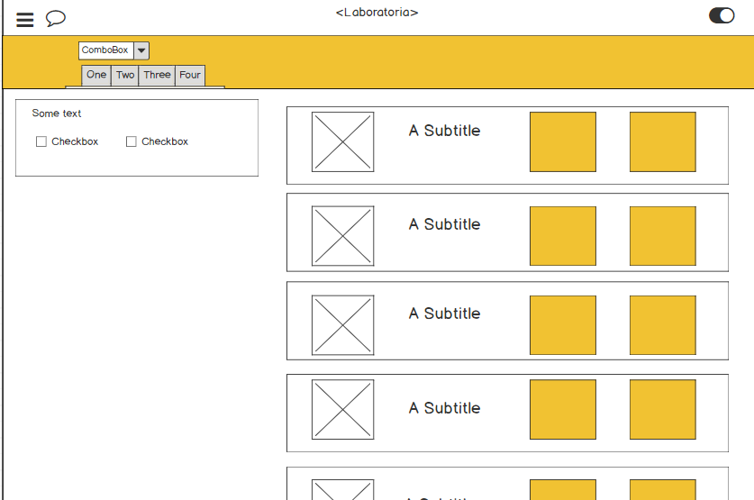

# **Data Dashboard**

Para este producto final se diseño un sketch tomando en cuenta el diseño de las participastes Jacqueline Martínes y Jacqueline Baez

# **Peticiones de cliente**
 * El total de estudiantes presentes por sede y generación.El porcentaje de deserción de estudiantes.
 * La cantidad de estudiantes que superan la meta de puntos en promedio de todos los sprints cursados. La meta de puntos es 70% del total de puntos en HSE y en tech.
 * El porcentaje que representa el dato anterior en relación al total de estudiantes.
 * El Net Promoter Score (NPS) promedio de los sprints cursados. El NPS se calcula en base a la encuesta que las estudiantes responden al respecto de la recomendación que darían de Laboratoria.
 * La cantidad y el porcentaje que representa el total de estudiantes que superan la meta de puntos técnicos en promedio y por sprint.
 * La cantidad y el porcentaje que representa el total de estudiantes que superan la meta de puntos de HSE en promedio y por sprint.
 * El porcentaje de estudiantes satisfechas con la experiencia de Laboratoria.
 * La puntuación promedio de l@s profesores.
 * La puntuación promedio de l@s jedi masters.

## Sketch

Los sketches fueron elaborados en balsamiq a continuación la liga:
 https://balsamiq.cloud/slw78/p1iyl/r9B59

## Ux
1. Se pensó en que el usuario tenga todos los datos precisos pero presentados de manera simple y resumida.
Se usáron los colores de la institución para generar uniformidad y consistencia

## UI
1. Menu de perfil que se oculta y aparece al igual que el chat para darle mayor espacio e importancia a los kpis del dashboard.
2. Selector para escoger por cede-generación.
3. Desarrollo de KPI por separado con sus respectivas gráficas.

Por medio del selector se fue accediendo a los datos de json en js.

3. Cuando hayas terminado tu producto, envía un Pull Request a este repositorio
   (puedes solicitar apoyo de tus profes para este paso).

> Nota: No olvides que es una buena práctica describir tu proyecto en este
> archivo `README.md` y también desplegar tu web a Github Pages :smiley:.
